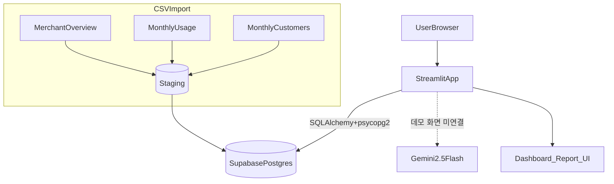

# AI Review & Sales Advisor

신한카드 데이터 기반 매출·리뷰 인사이트 공모전 프로젝트.
Streamlit 단일 앱 + Supabase Postgres. Gemini 2.5 Flash 연동 코드 포함(데모 화면은 규칙 기반 응답).

## 구현 범위 (2026-10-10 갱신)

소상공인이 매출·고객 데이터를 쉽게 비교하도록 가맹점·월별 이용·월별 고객 staging 테이블과 정규화 뷰를 구성하고, SQLAlchemy 조회 결과를 Streamlit 대시보드와 보고서 화면으로 연결합니다.

- 포함: staging 테이블 DDL, 기본키·외래키, 날짜·결측값 변환 뷰, 원천 특수값 처리, 지표 조회·조립, 대시보드, 보고서 화면, Gemini API 호출 코드, 특수값 처리 테스트.
- 챗봇·보고서 화면은 데모 모드입니다. 챗봇은 키워드 규칙(`ui/chat_view.py`의 `_route_answer`)에 따라 미리 작성한 답변을 출력하고, 보고서는 DB 지표를 넣은 문장 템플릿(`ui/marketing_report.py`의 `_story_from_df`, `USE_LLM = False`)을 출력합니다. Gemini 호출 코드(`app/chat_core.py`, `app/llm_client.py`)는 있으나 데모 화면에는 연결되어 있지 않습니다.
- 리뷰 화면은 `ui/Dashboard.py`의 `get_dummy_reviews` 샘플 데이터를 사용합니다. 리뷰 요약 함수(`ChatCore.summarize_reviews`)가 존재하지만 자동 수집 프로그램은 포함되어 있지 않습니다.
- CSV와 대응하는 DB 구조는 있으나 CSV 자동 적재 실행 프로그램·스케줄러·실패 재시도는 포함되어 있지 않습니다. 아래 CSVImport 다이어그램은 데이터 적재 흐름을 설명하며 자동화 완료를 뜻하지 않습니다.
- Gemini API 사용과 모델 재학습은 다릅니다. 이 저장소에는 Gemini 모델 자체의 재학습 코드가 없습니다.
- 향후 CSV 적재·품질 검증·중복 처리·실패 재시도를 추가해 반복 실행 가능한 파이프라인으로 확장할 수 있습니다.

---

## 1) 시스템 아키텍처



- DB는 Supabase. 로컬 DB 불필요.
- LLM 연결 시 DB 스키마를 근거로 한 JSON만 입력하도록 설계(현재 데모 화면에는 미연결).
- 보고서는 화면 표시만. PDF 비활성.

---

## 2) 폴더 구조

```text
app/
├─ repo/
│  ├─ compare_repo.py          # 동일 상권·업종 경쟁 매장 상위 3곳 쿼리
│  └─ metrics_repo.py          # 월별 지표 시계열·최신 스냅샷 쿼리
├─ services/
│  ├─ card_items_service.py    # KPI 카드 데이터 조립
│  └─ report_service.py        # 보고서 컨텍스트 조립(이전 버전, 현재 화면 미사용)
├─ chat_core.py                # LLM·DB 연결 코어(데모 화면 미연결)
├─ deps.py                     # DB 세션 관리
└─ llm_client.py               # Gemini 호출 래퍼
configs/
├─ aspects.json                # 아스펙트 사전(미작성)
└─ rules.json                  # 프롬프트 규칙(미작성)
db/
├─ ddl_001_create_raw_tables.sql    # staging 테이블 + 정규화 뷰(특수값 결측 처리)
├─ ddl_002_notes_views_indexes.sql  # 뷰 스키마 메모·예시 질의
└─ models.py
tests/
├─ test_db.py                  # DB 연결 확인 스크립트
└─ test_special_values.py      # 특수값(-999999.9) 처리 검증
ui/
├─ components/
│  └─ cards.py                 # KPI 카드 렌더링
├─ chat_view.py                # 챗 화면(규칙 기반 데모 답변)
├─ Dashboard.py                # 메인 화면
└─ marketing_report.py         # 보고서 화면(차트 + 템플릿 인사이트)
```

---

## 3) 화면 흐름

### 3.1 현재 데모

1. 사용자가 상권(성수·뚝섬)과 업종(카페·이자카야)을 선택하면, 미리 지정한 가맹점의 월별 지표를 `metrics_repo.py`로 조회합니다.
2. `card_items_service.py`가 KPI 카드를 조립하고 `ui/components/cards.py`가 화면에 표시합니다.
3. 보고서 버튼을 누르면 `marketing_report.py`가 차트, 경쟁 매장 상위 3곳, 지표 기반 템플릿 문장을 보여줍니다.
4. 챗봇 질문은 `chat_view.py`의 키워드 규칙으로 미리 작성한 답변에 연결됩니다.

### 3.2 LLM 연결 설계 (미연결)

- 입력: `metrics_json` + `schema_hint` + `configs/rules.json`.
- 출력 스키마 고정:

  ```json
  {
    "trend_2sent": "...",
    "segment_1sent": "...",
    "comp_1sent": "...",
    "actions": ["...", "...", "..."]
  }
  ```

- 금지: 외부 추정. 근거 없는 숫자.

### 3.3 핵심 함수 위치

- 지표 조회: `app/repo/metrics_repo.py`의 `fetch_timeseries`, `fetch_snapshot`
- 경쟁 매장: `app/repo/compare_repo.py`의 `fetch_top_competitors`
- KPI 카드: `app/services/card_items_service.py`의 `build_dashboard_cards`
- 보고서: `ui/marketing_report.py`의 `render_report`, `build_llm_context`, `_story_from_df`
- 챗봇: `ui/chat_view.py`의 `render_chat`, `_route_answer`
- LLM 호출(미연결): `app/chat_core.py`의 `ChatCore.call_llm`, `app/llm_client.py`의 `generate`, `generate_json`

---

## 4) 데이터·지표 로직

- 원천: 신한카드 성동구 요식업 가맹점 개요·월별 이용·월별 고객(CSV 3종).
- KPI: 매출·이용건수 구간, 업종대비 매출지수(100=업종 평균), 상권 내 백분위(낮을수록 상위), 배달 비중, 신규·재방문 비중, 성별·연령 분포.
- 비교: 전월 대비 증감, 업종 평균(=100), 동일 상권·업종 경쟁 매장 상위 3곳.

### 4.1 데이터 품질 규칙

| 원천 형태 | 처리 | 이유 |
| --- | --- | --- |
| 구간 문자열 (예: `2_10-25%`) | 구간 대표값(중앙값)으로 변환 (`10-25%` → 0.175) | 실제 금액이 아닌 상대적 위치이므로 순위 변화로 해석 |
| 특수값 `-999999.9` | `NULLIF`로 결측 처리, 0으로 보정하지 않음 | 0%는 평균·비교에 포함되는 실제 수치이고, 특수값은 '해당 없음'(예: 배달 미운영) 상태 |

특수값 처리 적용 범위:

- 정규화 뷰(`db/ddl_001_create_raw_tables.sql`): 비율 컬럼 22개
- 앱 조회 쿼리(`metrics_repo.py`, `compare_repo.py`): 화면에 쓰는 비율·지수 컬럼 전체
- 화면: 결측은 평균 계산에서 제외(`mean(skipna=True)`)하고, KPI 카드는 0%가 아닌 `-`로 표시하며 증감은 표시하지 않음

예시(테스트 데이터, 배달 비중이 12.5% → 0% → 특수값인 3개월):

| 처리 방식 | 마지막 달 카드 | 3개월 평균 배달 비중 |
| --- | --- | --- |
| 특수값을 0으로 보정 | 0.0% | 4.17% |
| 결측 처리(현재) | `-` | 6.25% |

예시 쿼리(`metrics_repo.py` 발췌):

```sql
select
  to_date(ta_ym,'YYYYMM')::date              as month,
  regexp_replace(rc_m1_saa, '.*_', '')       as sales_bucket_raw,  -- '2_10-25%' → '10-25%'
  nullif(dlv_saa_rat, -999999.9)             as delivery_ratio,    -- 특수값 → NULL
  nullif(m12_sme_bzn_saa_pce_rt, -999999.9)  as area_rank_pct      -- 상권 내 백분위
from public.stg_merchant_monthly_usage
where encoded_mct = :m
order by 1;
```

---

## 5) UI 구성

- 상단: 상권·업종 선택, 리뷰 티커(샘플).
- 챗봇 질문 입력 → 챗 화면 전환(규칙 기반 데모 답변).
- 마케팅 보고서: 월별 매출 구간 추이, 업종 평균 대비 매출지수, 상권 내 순위, 연령·성별 분포 차트, 경쟁 매장 상위 3곳, 템플릿 인사이트.
- KPI 카드: 업종대비 매출지수, 상권 내 백분위, 배달 비중, 방문 구성.
- 제외: 업종 내 백분위, 업종대비 건수지수.
- 하단: 오늘 리뷰(샘플).
- 스타일: 동일 높이 카드, 작은 폰트, 다크 모드.

---

## 6) 실행

```bash
py -3.12 -m venv .venv
# Windows: .\.venv\Scripts\activate
# macOS/Linux: source .venv/bin/activate
pip install -r requirements.txt
streamlit run ui/Dashboard.py
```

환경변수:

- 필수: `DATABASE_URL`
- 선택(LLM 연결 시): `GEMINI_API_KEY`, `GEMINI_MODEL`

---

## 7) 데모 시나리오

- 상권×업종 4케이스 고정. 가맹점 ID(ENCODED_MCT)는 `ui/Dashboard.py`의 `DEMO_MCTS`에 지정.
- 선택 즉시 해당 가맹점의 월별 KPI·고객 구성·경쟁 매장 로드.
- 보고서는 화면 카드에만 표시.

---

## 8) 테스트

- `tests/test_db.py`: DB 연결 확인 스크립트(`python tests/test_db.py`).
- `tests/test_special_values.py`: 특수값 처리 검증. 운영 DB 보호를 위해 로컬 Postgres 주소에서만 실행됩니다.

  ```bash
  TEST_DATABASE_URL=postgresql+psycopg2://postgres@localhost:5432/postgres \
    pytest tests/test_special_values.py
  ```

  검증 항목: 정규화 뷰와 앱 쿼리에서 특수값이 NULL로 분리되는지, KPI 카드가 `-`로 표시되는지, 평균 계산에서 제외되는지, 경쟁 매장 표에 원천 특수값이 노출되지 않는지.

---

## 9) 향후 계획

| 영역            | 내용                                 | 목적   |
| --------------- | ------------------------------------ | ------ |
| 데이터 자동화   | ETL 스케줄러, 중복 제거, 실패 재시도 | 최신성 |
| 리뷰 파이프라인 | 정규화·중복 제거·언어 감지·아스펙트  | 품질   |
| LLM 비용 최적화 | 캐시, 샘플링 축소, 요약 저장         | 비용   |
| 추천            | 업종 벤치마크 기반 액션              | 자동화 |
| LangGraph       | DB→요약→액션 체인 명시화             | 재현성 |
| 권한            | RLS·가맹점 단위 접근                 | 보안   |
| 실험            | A/B 카드 레이아웃·리텐션 모듈        | 성과   |

---

## 10) 참고

- 데이터 출처: 신한카드 요식업종 성동구.
- 분석 초점: 카페(성수·뚝섬) 중심.
